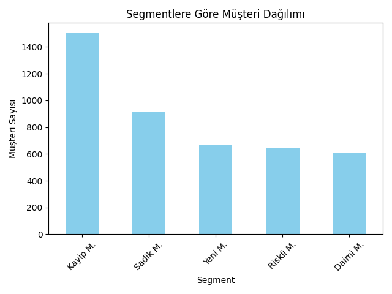
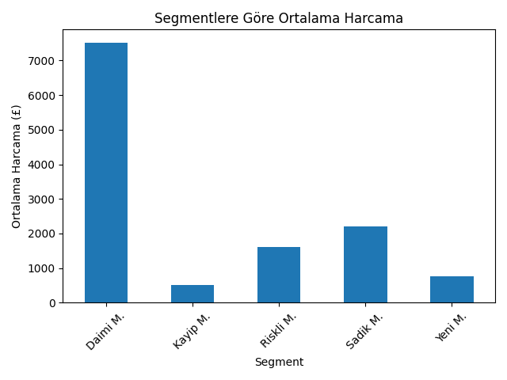
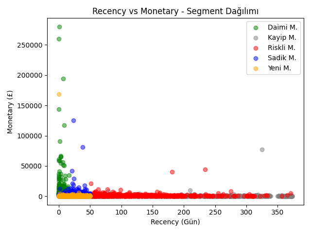

# Müşteri Segmentasyonu — RFM Analizi

## Proje Özeti

E-ticaret şirketleri, müşteri davranışlarını anlamak ve pazarlama stratejilerini geliştirmek için müşteri segmentasyonu yöntemlerinden yararlanır.

Bu projede bir e-ticaret veri seti kullanılarak RFM (Recency, Frequency, Monetary) analizi uygulanmış ve müşteriler satın alma davranışlarına göre farklı segmentlere ayrılmıştır.

Projenin amacı:
- müşteri davranışlarını analiz etmek
- değerli müşterileri belirlemek
- potansiyel pazarlama stratejileri geliştirmektir.

## İş Problemi

Bir e-ticaret şirketinde tüm müşteriler aynı değere sahip değildir.
Bazı müşteriler:
- sık alışveriş yapar
- yüksek miktarda harcama yapar
- düzenli olarak geri döner
Bazı müşteriler ise:
- yalnızca bir kez alışveriş yapar
- zamanla alışveriş yapmayı bırakır
Bu nedenle şirketler müşterilerini segmentlere ayırarak:
- sadık müşterileri koruyabilir
- riskli müşterileri geri kazanabilir
pazarlama kampanyalarını hedefleyebilir

## Veri Seti

- Kaynak:
    UCI Machine Learning Repository — Online Retail :
    https://archive.ics.uci.edu/dataset/352/online+retail
- Kapsam:
    2010-2011, İngiltere merkezli bir e-ticaret sitesinin verileri
- Ham Veri:
    541.909 satır, 8 sütun
- Temizlenmiş Veri:
    397.884 satır

## Veri Setindeki Değişkenler
Ham Veri(data/Online Retail.xlsx):
- InvoiceNo : Fatura numarası
- StockCode : Ürün kodu
- Description : Ürün açıklaması
- Quantity : Satın alınan ürün miktarı
- InvoiceDate : İşlem tarihi
- UnitPrice : Birim fiyat
- CustomerID : Müşteri kimliği
- Country : Müşteri ülkesi

Türetilen Değişkenler(data/rfm.csv):

- TotalPrice : Quantity × UnitPrice
- Recency : En son alışverişten bu yana geçen gün sayısı
- RecencyScore: Recency değerinin skoru
- Frequency : Toplam fatura sayısı
- FrequencyScore : Frequence değerinin skoeu
- Monetary : Toplam harcama miktarı (£)
- Monetary : Monetary değerinin skoru
- Score : RFM skorlarının birleşimi
- Segment : Müşteri segmenti

## Veri Temizleme

Ham verinin yaklaşık %27'si temizleme sürecinde çıkarıldı:
- `CustomerID` boş olan satırlar kaldırıldı (~135.000 satır)
- Negatif ve sıfır miktarlı işlemler kaldırıldı (iade işlemleri)
- Sıfır ve negatif fiyatlı ürünler kaldırıldı
- `InvoiceDate` sütunu `datetime` formatına dönüştürüldü

## RFM Analizi

RFM, müşteri davranışını üç temel metrikle ölçer:
- Recency : En son alışverişten bu yana geçen gün sayısı
- Frequency : Toplam fatura sayısı 
- Monetary : Toplam harcama miktarı (£)

## Skorlama Yöntemi

`pandas rank` metodu ile müşteriler yüzdelik dilimlere göre sıralanıp 4 eşit gruba bölündü. Her metrik 1-4 arasında skorlandı.
- Frequency & Monetary: Yüksek değer → Yüksek skor
- Recency: Düşük değer → Yüksek skor

## Segmentler

* Segment | Kural | Müşteri Sayısı | Toplam Müşteri Sayısına Oranı
- Daimi Müşteri | Recency=4, Frequency=4 | 609 | ~%14
- Sadık Müşteri | Recency≥3, Frequency≥3 | 914 | ~%21
- Yeni Müşteri | Recency≥3, Frequency≤2 | 665 | ~%15
- Riskli Müşteri | Recency≤2, Frequency≥3 | 646 | ~%15
- Kayıp Müşteri | Recency≤2, Frequency≤2 | 1504 | ~%35

## Bulgular ve Görselleştirmeler

Projede aşağıdaki görselleştirmeler oluşturulmuştur:
- Recency vs Monetary scatter plot
- RFM segment dağılımı
- Müşteri harcama dağılımı
Grafikler visualization.py dosyasında üretilmektedir.

### 1.Segmentlere Göre Müşteri Dağılımı

Müşterilerin %35'i Kayıp Müşteri segmentinde yer almaktadır. Bu, şirketin ciddi bir müşteri elde tutma problemiyle karşı karşıya olduğunu göstermektedir. Buna karşın Sadık ve Daimi müşteriler birlikte toplam müşterilerin %35'ini oluşturmaktadır.

### 2.Segmentlere Göre Ortalama Harcama

Daimi Müşterilerin ortalama harcaması ~£7.500 ile diğer tüm segmentlerin çok üzerindedir. Kayıp Müşterilerin ortalaması ise ~£500 ile en düşük seviyededir. Bu fark, Daimi Müşterilerin korunmasının ne kadar kritik olduğunu açıkça ortaya koymaktadır.

### 3.Recency vs Monetary — Segment Dağılımı

Scatter plot, yakın zamanda alışveriş yapan müşterilerin aynı zamanda en çok harcayan müşteriler olduğunu görsel olarak doğrulamaktadır. Daimi Müşteriler sol üst köşede yoğunlaşırken Kayıp Müşteriler sağ alt köşede toplanmaktadır.

## İş Önerileri
- Daimi Müşteri :
    VIP programı, erken erişim kampanyaları ile bağlılık korunmalı
- Sadık Müşteri : 
    Çapraz satış (cross-sell) kampanyaları ile harcama artırılabilir
- Yeni Müşteri : 
    Hoş geldin indirimleri ile alışveriş sıklığı artırılabilir
- Riskli Müşteri : 
    Geri kazanım e-postaları ve özel indirim kuponları gönderilmeli
- Kayıp Müşteri : 
    Düşük maliyetli otomatik e-posta kampanyaları denenebilir

## Kullanılan Teknolojiler
- Python(pandas, matplotlib)

## Dosya Yapısı
customer-segmentation/
│── data/
│   ├── Online Retail.csv          # Ham veri
│   └── rfm_segments.csv           # Segmentlenmiş son veri
|── images/
|   ├── musteri_dagilimi.png
|   ├── ortalama_harcama.png
|   └── segment_dagilimi.png
│── exploration.py                 # Veri temizleme ve RFM analizi
│── visualization.py               # Görselleştirmeler
│── README.md

**Mertol Açıkgöz**   
mertolacikgoz93@gmail.com